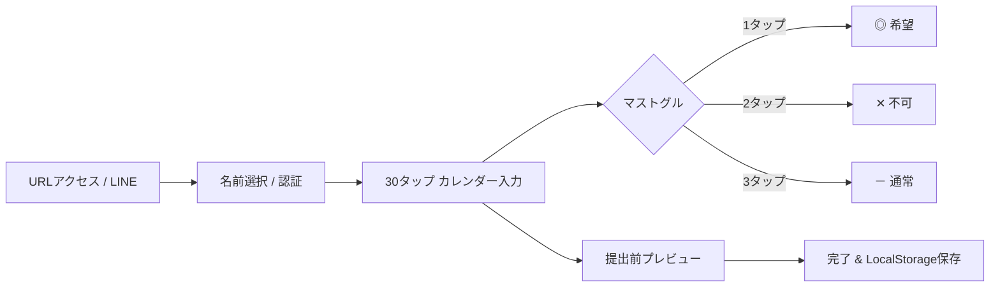

# 日本の飲食店向けシフト管理SaaS・主要10社 【競合機能・詳細仕様 網羅リファレンス】

**作成日**: 2026年8月14日  
**目的**: 日本国内の飲食店向け主要シフト管理SaaS・アプリ（Airシフト、らくしふ、シェアフルシフト、Optamo、シフオプ、SHIFTEE、お助けマン、ジョブカン、KING OF TIME、CAST）の**「全機能・画面仕様・アルゴリズム・制約パラメータ・エッジケース処理」**を1つのファイルに完全網羅・統合する。

---

## 1. 主要10製品 機能別 装備状況・詳細比較マトリクス

| 機能カテゴリ | 具体機能・詳細仕様 | Airシフト | らくしふ | シェアフルシフト | Optamo | シフオプ | SHIFTEE | お助けマン | ジョブカン | KING OF TIME | CAST |
| :--- | :--- | :---: | :---: | :---: | :---: | :---: | :---: | :---: | :---: | :---: | :---: |
| **スタッフ入力** | ◯ / ✕ / 時間帯指定（スライダー・トグル） | ◎ | ◎ | ◎ | ◎ | ◎ | ◎ | ◎ | ◎ | ◎ | ◎ |
| | ◎（強く希望）優先指定 | ◯ | ◎ | ◯ | ◎ | ◯ | ◯ | ◎ | △ | △ | ◯ |
| | **LINE上で提出完結 (専用アプリ不要)** | ✕ | **◎** | ✕ | ✕ | ✕ | ✕ | ✕ | △ | ✕ | **◎** |
| | **ログインレス (URL/名前選択で即入力)** | ✕ | **◎** | ✕ | **◎** | **◎** | ✕ | **◎** | **◎** | **◎** | ✕ |
| | 締切前自動リマインド通知 (LINE/Push) | ◎ | ◎ | ◎ | ◯ | ◎ | ◯ | ◯ | ◎ | ◎ | ◎ |
| | パターン一括流し込み（固定曜日・時間） | ◎ | ◎ | ◎ | ◯ | ◎ | ◎ | ◯ | ◎ | ◎ | ◯ |
| **確定・個人管理** | 確定シフト一括通知 (LINE/Push/Mail) | ◎ | ◎ | ◎ | ◎ | ◎ | ◎ | ◎ | ◎ | ◎ | ◎ |
| | Google / iOS カレンダー同期 (iCal) | ◎ | ◎ | ◯ | ✕ | ◯ | ◯ | ✕ | ◯ | ◯ | ◎ |
| | **概算給与 リアルタイム自動計算** | **◎** | ◯ | ◯ | ✕ | ◯ | ◯ | ✕ | ◯ | ◯ | **◎** |
| | **年収の壁 (103万/106万/130万) 残枠ゲージ** | ◯ | **◎** | ◯ | ✕ | **◎** | ◯ | ✕ | ◯ | ◯ | ✕ |
| | 同僚シフトの閲覧範囲切替（自/同/全） | ◎ | ◎ | ◎ | ◯ | ◎ | ◎ | ◯ | ◎ | ◎ | ◎ |
| **突発・交代** | **バイト間シフト交代 (トレード・店長1タップ承認)**| △ | ◯ | ◯ | ✕ | ◯ | ◯ | ✕ | ✕ | ✕ | **◎** |
| | 欠員・ヘルプ募集へのワンタップ応募 | ◯ | **◎** | **◎** | ◯ | **◎** | ◯ | ✕ | ◯ | ◯ | ◯ |
| **作成エンジン** | ルールベース自動割当 (基本パターン) | ◎ | ◎ | ◎ | ◎ | ◎ | ◎ | ◎ | ◎ | ◎ | ◎ |
| | **数理最適化ソルバー (厳密解・CP-SAT等)** | ✕ | ◯ | ✕ | **◎** | ✕ | ✕ | **◎** | ✕ | ✕ | ✕ |
| | **AI機械学習 (店長修正傾向の学習)** | **◎** | ◯ | ✕ | ✕ | ✕ | ✕ | ✕ | ✕ | ✕ | ✕ |
| | **役職・責任者常駐制約 (必須資格1名以上)** | ◯ | ◎ | ◯ | **◎** | ◎ | ◎ | **◎** | ◯ | ◯ | △ |
| | **スタッフ相性 (NGペア / GOODペア)** | ✕ | ◯ | ✕ | **◎** | ◯ | ◯ | **◎** | ✕ | ✕ | ✕ |
| | **15分/30分刻み タスク割当 (仕込み/レジ等)** | ✕ | ✕ | ✕ | **◎** | ✕ | ✕ | ✕ | ✕ | ✕ | ✕ |
| | **スラック緩和変数 (欠員枠の薄赤可視化)** | ◎ | ◎ | ◎ | **◎** | ◎ | ◎ | **◎** | ◯ | ◯ | ◯ |
| **労務・法令** | **年少者(18歳未満)深夜22時以降禁止** | ◎ | **◎** | ◯ | **◎** | **◎** | **◎** | **◎** | ◯ | **◎** | ◯ |
| | 週40h・連続勤務上限・法定休憩自動判定 | ◎ | ◎ | ◎ | ◎ | ◎ | ◎ | ◎ | ◎ | ◎ | ◯ |
| | 勤務間インターバル時間チェック (11h) | ◯ | ◎ | ◯ | **◎** | ◯ | ◯ | **◎** | ◯ | ◯ | ✕ |
| **人件費・予実** | **概算人件費 リアルタイム再計算** | **◎** | **◎** | ◎ | ◎ | **◎** | ◎ | ◯ | ◎ | ◎ | ◎ |
| | **人時生産性・人時売上高 (L/P) 算出** | **◎** | **◎** | **◎** | ◯ | **◎** | ◯ | ◯ | ◯ | ◯ | ✕ |
| | **POSレジ・売上予測データ連動** | **◎** | **◎** | ◯ | ✕ | ◯ | ✕ | **◎** | ◯ | ◯ | ✕ |
| **多店舗・外部** | **店舗間ヘルプ募集・スタッフシェア** | △ | **◎** | **◎** | ◯ | **◎** | ◯ | ✕ | ◯ | **◎** | ✕ |
| | **スキマバイト (タイミー/シェアフル等) 連携** | ✕ | ✕ | **◎** | ✕ | ✕ | ✕ | ✕ | ✕ | ✕ | ✕ |
| | **応援時間・人件費の自動勘定振替** | ✕ | ◯ | ◯ | ✕ | **◎** | ◯ | ✕ | ◯ | **◎** | ✕ |
| | **LINE共有用テキスト一括生成** | ✕ | **◎** | ✕ | ✕ | ✕ | ✕ | ✕ | ✕ | ✕ | **◎** |
| | 給与計算ソフト別 CSV/API エクスポート | ◎ | **◎** | ◎ | ◯ | **◎** | ◎ | ◯ | **◎** | **◎** | ◯ |

---

## 2. 主要10製品 各製品の機能詳細仕様

### ① Airシフト（リクルート）
* **AI作成アシスト**: 店長が過去に修正した配置パターンやスタッフの組み合わせのクセを機械学習し、次回以降の提案精度を向上。
* **シフトボード連動**: アルバイト向け給与計算・シフト管理アプリ「シフトボード」と自動同期。確定シフトがスタッフ私生活カレンダーに自動反映。
* **Airレジ連携**: POS売上データと連動し、日別人件費率（FL比率）をリアルタイム可視化。

### ② らくしふ（クロスビット / SmartHRグループ）
* **LINE完結UX**: 店舗公式LINEのリッチメニューから「希望提出」「確定確認」「欠員応募」がアプリ不要で完結。
* **高度なモデルシフト自動生成**: AI ＆ 数理最適化により、時間帯・曜日別の必要人数・スキル構成とスタッフ希望をマッチング。
* **多店舗エリアダッシュボード**: チェーン全店舗のシフト充足率・人件費を本部から一元監視、LINEで店舗間ヘルプを一斉公募。

### ③ シェアフルシフト（パーソル / 旧Sync Up）
* **店舗間スタッフシェア**: 同一エリア内複数店舗で空き時間スタッフを融通。
* **スキマバイト求人連携**: 自社スタッフで埋まらなかった不足シフト枠を、ワンクリックで外部ギグワーク「シェアフル」へ求人出稿。

### ④ Optamo（ラック / モーション）
* **数理計画法（厳密解ソルバー）**: 勤務希望、労働法規、スキルレベル、スタッフ相性（NGペア/GOODペア）を数理モデル化。
* **時間単位タスク割当 (Optamo for Task)**: シフト枠だけでなく、15分〜30分刻みの「仕込み」「レジ」「焼き場」「洗い場」などの日次タスク表まで全自動生成。

### ⑤ 勤務シフト作成お助けマン（JRシステム / 鉄道情報システム）
* **数理最適化ソルバー（Numerical Optimizer）**: JRの運行ダイヤ作成技術を応用。時間帯別アルバイト配置特化型「Time」を提供。
* **Infeasible時の矛盾提示**: 条件が厳しすぎて解が出ない場合、どの条件が矛盾しているか（ボトルネック）を分析して代替案を出力。

### ⑥ シフオプ（リクルート）
* **エンタープライズ・チェーン統制**: 本部-エリアマネージャー-店長の階層権限管理。
* **扶養控除（103万/130万）超過アラート**: 年間累計給与の超過ペースを自動検知し、法令違反を防止。

### ⑦ SHIFTEE（システムサポート）
* **ガントチャート直感操作**: エクセル感覚で使える直感的なマウスドラッグ＆ドロップUI。
* **120種以上の現場カスタマイズ**: 飲食店の現場要望を網羅した詳細なスキルマトリクスと条件設定。

### ⑧ ジョブカン勤怠管理（DONUTS）
* **勤怠・給与一気通貫**: GPS・LINE・ICカード打刻とシフト予定をリアルタイム突合し、残業・遅刻を自動集計。

### ⑨ KING OF TIME（ヒューマンテクノロジーズ）
* **応援勤務の人件費自動振替**: 他店舗ヘルプの労働時間・給与を応援先店舗の勘定に自動振替。
* **36協定・労基法準拠**: 法定労働時間、変形労働時間制、年次有給休暇の完全自動管理。

### ⑩ CAST（hachidori）
* **店舗専用チャット ＆ シフト交代**: アプリ内チャットでバイト同士がシフト交代を相談し、店長が承認するだけでシフト表が自動更新。

---

## 3. スタッフ向けUI・マイクロインタラクション仕様



1.  **30タップ以内入力**:
    *   カレンダーのマス目をタップするごとに `通常(－) ➔ ◎希望 ➔ ✕不可 ➔ 通常(－)` が循環切り替え。
2.  **年少者保護UIガード**:
    *   18歳未満スタッフ選択時、**22:00以降にかかる深夜シフト枠が自動で disabled（グレーアウト＋深夜禁止ラベル表示）** になり誤入力を物理防止。
3.  **プライベート連携**:
    *   確定シフトのGoogleカレンダー / iOSカレンダー（`webcal://`）自動同期。
    *   確定画面で `◎ 希望通り`（緑）と `◯ 割当`（黄）を明確に色分け表示。

---

## 4. 数理最適化エンジン (OR-Tools CP-SAT) 完全モデル

### 目的関数
$$\min \quad \underbrace{W_{\text{shortage}} \sum_{d \in D} \sum_{s \in S} u_{s, d}}_{\text{人手不足ペナルティ (10,000)}} + \underbrace{W_{\text{cost}} \sum_{e,s,d} (\text{Wage}_e \times \text{Hours}_s \times x_{e,s,d})}_{\text{総人件費最小化 (1)}} - \underbrace{W_{\text{want}} \sum_{\text{Want}} x_{e,s,d}}_{\text{希望充足ボーナス (500)}} + \underbrace{W_{\text{fair}} \sum_{e} (\text{Days}_e - \overline{\text{Days}})^2}_{\text{出勤日数公平性 (50)}}$$

### Hard制約式（100%厳守）
1.  **年少者保護（労基法第60条）**: $\forall e \in \text{Minor}, \forall s \in \text{LateNight}: x_{e, s, d} = 0$
2.  **不可シフト（Unavailable）**: $\forall (e, s, d) \in \text{Unavailable}: x_{e, s, d} = 0$
3.  **1日1勤務原則**: $\sum_{s} x_{e, s, d} \le 1$
4.  **連続勤務日数上限**: $\sum_{k=0}^{K_e} y_{e, d+k} \le K_e$
5.  **週40時間上限**: $\sum_{d \in \text{Week}} \sum_{s} (\text{Hours}_s \times x_{e, s, d}) \le \text{MaxWeeklyHours}_e$
6.  **必要人員・責任者常駐（スラック付き）**: $\sum_{e} x_{e, s, d} + u_{s, d} \ge \text{MinStaff}_{s, d}$

---

## 5. 飲食現場特有のエッジケース処理仕様

1.  **深夜0時（24:00+）跨ぎシフト**:
    *   `24:30` や `01:00` を内部的に `24.5h`, `25.0h` で数値パースし、日跨ぎマイナス計算バグを根絶。22時以降を自動分離して25%深夜割増計算。
2.  **中抜けシフト（スプリット勤務）**:
    *   ランチ（11:00-14:30）＋ ディナー（17:30-22:00）の中抜け間隔を「無給休憩」として扱い、日合計実働8.0h・法定休憩45分充足を自動集計。
3.  **突発欠勤の再最適化（Warm Start）**:
    *   当日欠勤発生時、他の確定シフトを固定したまま穴埋めのみを最小変更コストで再計算。

---

## 6. FoodShift（自社）の決定打・ポジショニング

```text
               【高価格・チェーン向け・導入重い】
                              ▲
                              │     ● らくしふ (LINE/AI)
      ● Optamo (数理最適化)    │
      ● お助けマン            │     ● シフオプ (リクルート)
                              │     ● シェアフルシフト
──────────────────────────────┼─────────────────────────────►【機能性 / 最適化度】
                              │
   【手動・簡易】              │  ★ FoodShift (AI Scheduler)
      ● 紙・Excel             │     - 完全0円インフラ (Render+Vercel)
      ● CAST                  │     - 完全ステートレス (LocalStorage)
      ● 汎用LINEグループ       │     - OR-Tools CP-SAT 数理最適化
                              │     - ログインレス・30タップ以内
                              ▼
               【完全0円・即導入・現場即戦力】
```

*   **完全0円インフラ ＆ 完全ステートレス**: Vercel + Render（DBレス・LocalStorage完結）により運用コスト0円・データ消失ゼロ。
*   **OR-Tools CP-SAT による厳格な制約遵守**: 労基法18歳未満深夜禁止や連続勤務制限を 1.0秒 で100%厳守求解。
*   **現場摩擦ゼロの「ログインレス × LINE共有」UX**: アカウント作成・アプリDL不要、名前選択と30タップで提出、LINE一括コピー ＆ CSV出力完備。
