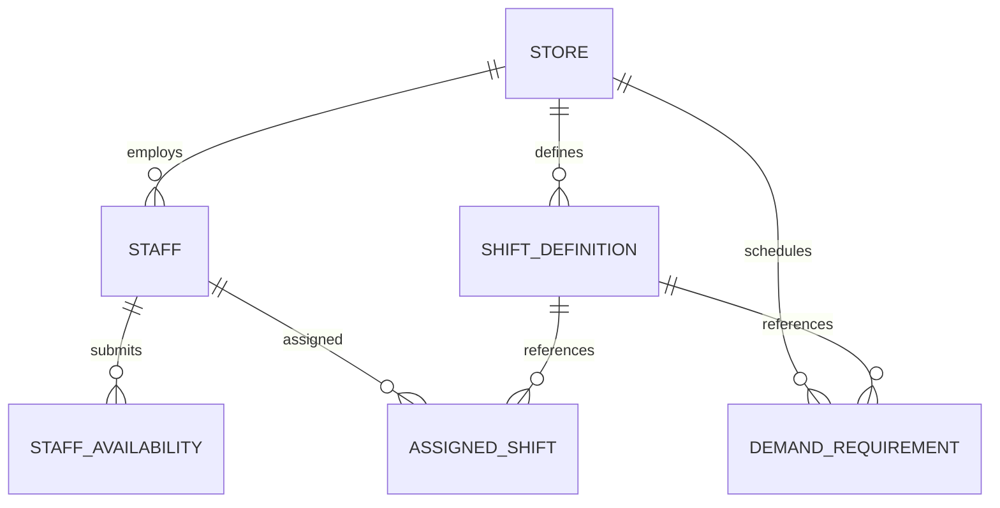

# 日本の飲食店シフト管理SaaS・ITアプリ 【超詳細・全機能仕様リファレンス】

**作成日**: 2026年8月14日  
**目的**: 日本国内の主要シフト管理システム（Airシフト、らくしふ、シェアフルシフト、Optamo、シフオプ、SHIFTEE、お助けマン、ジョブカン、KING OF TIME、CAST等）が備える全機能、画面仕様、数理モデル、UIマイクロインタラクション、データ構造、エッジケース処理を極限まで詳細に網羅する。

---

## 1. システム共通データ構造・内部マスター仕様

日本の飲食店におけるシフト管理システムが保持すべきデータエンティティと内部フィールドの詳細仕様です。



### 1.1 スタッフマスター (Staff Entity)
| フィールド名 | 型 / 制約 | 詳細仕様・バリデーション |
| :--- | :--- | :--- |
| `id` | String (PK) | 一意なスタッフID（例: `staff_001`） |
| `name` | String | スタッフ氏名（例: `佐藤 健`） |
| `birth_date` | Date (YYYY-MM-DD) | 生年月日。**満18歳判定（労基法第60条 年少者深夜業禁止）に使用**。システム日付時点で18歳未満なら `is_minor = true` を動的フラグ化。 |
| `roles` | Array[String] | 担当可能ポジション（`hall`, `kitchen_warm`, `kitchen_cold`, `prep`, `dish`, `manager_agent` 等） |
| `skill_levels` | Map[Role, Int(1..5)] | ポジションごとの熟練度（1: 新人, 3: 一人前, 5: 指導・締め可能リーダー） |
| `hourly_wage` | Integer | 基本時給（円）。時間帯別時給テーブル（例: 土日祝+100円、高校生-50円）と連動。 |
| `max_consecutive_days` | Integer (1..14) | 連続勤務日数上限（通常は **5日**、学生は **3日**、フリーターは **6日** 等）。 |
| `max_weekly_hours` | Float (0.0..60.0) | 週間労働時間上限（法定上限 **40.0h**、社会保険非加入者は **19.5h** 等）。 |
| `target_monthly_hours` | Float (0.0..200.0) | 月間目標労働時間（スタッフの稼ぎたい希望額に応じた目標値）。 |
| `tax_wall_category` | Enum | 年収の壁区分（`none`, `wall_103m` [所得税/親扶養], `wall_106m` [社保加入], `wall_130m` [配偶者扶養]） |
| `ng_staff_ids` | Array[String] | **相性NGリスト**。同一シフト・同一時間帯への同時配置を回避するスタッフID配列。 |
| `good_staff_ids` | Array[String] | **育成・ペア推奨リスト**。新人教育などのため同日配置を推奨するスタッフID配列。 |

---

### 1.2 シフト枠マスター (Shift Definition Entity)
| フィールド名 | 型 / 制約 | 詳細仕様・バリデーション |
| :--- | :--- | :--- |
| `id` | String (PK) | シフトID（例: `lunch_peak`, `dinner_late`, `midnight_clean`） |
| `name` | String | シフト表示名（例: `ランチ早番`, `ディナーピーク`, `深夜・締め`） |
| `start_time` | String (HH:MM) | 勤務開始時刻（例: `10:00`, `17:30`） |
| `end_time` | String (HH:MM) | 勤務終了時刻（例: `15:00`, `24:30` [深夜24時超えは `24:30` または翌 `00:30` 表記]） |
| `duration_hours` | Float | 実拘束時間から法定休憩を差し引いた実働時間数（例: `4.5h`） |
| `is_late_night` | Boolean | **22:00〜05:00の深夜時間帯を含むかどうかの真偽値**。 |
| `break_minutes` | Integer | 設定休憩時間（45分、60分等。6h超で45分、8h超で60分を自動算出）。 |
| `is_split_shift` | Boolean | **中抜けシフトフラグ**（1日の中で昼・夜の2回勤務を行う形態）。 |

---

## 2. スタッフ向け（従業員・アルバイト）全機能 詳細仕様

### 2.1 ログインレス ＆ LINEシフト提出インターフェース
*   **認証・アクセス方式**:
    *   **方式A: LINEミニアプリ / LINE Bot連携 (らくしふ型)**
        *   店舗公式LINEのトーク画面下部「リッチメニュー」に「シフトを提出する」ボタンを常設。
        *   タップするとLINE OAuthによりユーザー認証が自動完了し、Webビュー（LIFF）で入力画面が即起動。
    *   **方式B: トークン付きセキュアURL / 名前選択 (FoodShift型)**
        *   管理者が発行したURL（`https://.../submit?token=xxx`）にアクセス。
        *   アカウント登録・パスワード入力不要。ドロップダウンから自分の名前を選択するだけで入力画面へ遷移。
*   **希望入力マイクロインタラクション（30タップ最適化）**:
    *   **マストグル操作**: カレンダーの日付×シフト枠のマス目をタップするごとにステータスが循環切り替え：
        $$\text{通常 (－: available)} \xrightarrow{\text{1タップ}} \text{◎ 希望 (want)} \xrightarrow{\text{1タップ}} \text{✕ 不可 (unavailable)} \xrightarrow{\text{1タップ}} \text{通常 (－)}$$
    *   **一括パターン入力**: 「毎週火・木のディナーを全て◎にする」「月曜を全て✕にする」曜日一括適用ボタン。
    *   **年少者保護UIガード**:
        *   スタッフマスターで `is_minor == true`（18歳未満）のスタッフが選択された場合、**22:00以降にかかる深夜シフト枠のボタンが自動的に disabled（非活性・グレーアウト）化**され、「深夜業禁止（労基法第60条）」ラベルが表示されてタップ不能になる。
*   **提出前サマリー・バリデーション**:
    *   提出ボタン押下時に「今月の提出日数: ◯日」「希望合計時間: 約◯時間」「想定概算月給: 約◯◯,◯◯◯円」のプレビューモーダルを表示。
    *   提出完了後、即座に「✓ シフト希望を保存しました」の完了フィードバックを表示し、LocalStorageおよびサーバーへ即時コミット。

---

### 2.2 確定シフト閲覧・プライベート連携機能
*   **パーソナライズ確定ビュー**:
    *   確定シフト公開後、スタッフ画面トップに「あなたの今月の確定シフト一覧」を表示。
    *   希望通り割当（緑バッジ: `◎ 希望通り`）と、通常割当（黄バッジ: `◯ 割当`）を明確に色分け。
*   **Googleカレンダー / iOSカレンダー同期 (iCal)**:
    *   `webcal://` プロトコルまたは `.ics` ファイルエクスポートにより、確定シフト（店舗名、勤務時間、ポジション）が私生活のスマホカレンダーに自動インポート。
*   **扶養控除・年収の壁メーター**:
    *   年間累計給与（1月〜当月確定シフト＋見込み）をリアルタイム棒グラフで表示。
    *   「103万円まで残り ￥142,000（今月あと約 118 時間勤務可能）」といった残枠アラート。

---

### 2.3 バイト間シフトトレード（交代依頼）機能
*   **交代依頼の発行**:
    *   スタッフAが確定シフトから特定の日時（例: 8月20日 ディナー）を選択し、「交代を依頼する」ボタンを押下。
    *   理由（体調不良、急用、試験等）を選択/入力し、同僚スタッフへ一斉通知。
*   **同僚の引き受け ＆ 店長承認ワークフロー**:
    *   通知を受け取ったスタッフBが「引き受ける」を押下。
    *   店長画面に「シフト交代申請: 8/20 ディナー 佐藤 ➔ 田中」がポップアップ通知。
    *   店長が「承認」を押すと、シフト表の割当が即座に自動更新され、両名にLINE通知。

---

## 3. 店長・管理者向け「数理最適化エンジン」完全仕様

### 3.1 数理計画モデル（OR-Tools CP-SAT 定式化）

本システムの最適化エンジンは、以下の厳密な数理モデルに基づいて求解されます。

#### 集合とインデックス
*   $E$: 全スタッフの集合 ($e \in E$)
*   $D$: スケジュール対象日数 ($d \in \{0, 1, \dots, N-1\}$)
*   $S$: シフト枠の集合 ($s \in S$)
*   $R$: 職能・ポジションの集合 ($r \in R$)

#### 決定変数
*   $x_{e, s, d} \in \{0, 1\}$: スタッフ $e$ が日 $d$ のシフト $s$ に勤務する場合 $1$、それ以外 $0$。
*   $y_{e, d} \in \{0, 1\}$: スタッフ $e$ が日 $d$ に少なくとも1回勤務する場合 $1$、それ以外 $0$。
*   $u_{s, d} \ge 0$ (整数): 日 $d$ のシフト $s$ における**人員不足数（スラック緩和変数）**。

---

#### 目的関数 (Objective Function)
以下のコスト関数の**最小化**を行います：

$$\min \quad \underbrace{W_{\text{shortage}} \sum_{d \in D} \sum_{s \in S} u_{s, d}}_{\text{人員不足ペナルティ (最優先)}} + \underbrace{W_{\text{cost}} \sum_{e} \sum_{s} \sum_{d} (\text{Wage}_e \times \text{Hours}_s \times x_{e,s,d})}_{\text{総人件費}} - \underbrace{W_{\text{want}} \sum_{(e,s,d) \in \text{Want}} x_{e,s,d}}_{\text{希望シフト充足ボーナス}} + \underbrace{W_{\text{fair}} \sum_{e} (\text{Days}_e - \overline{\text{Days}})^2}_{\text{出勤日数公平性ペナルティ}}$$

*   **重みパラメータ標準値**:
    *   $W_{\text{shortage}} = 10,000$ （不足は絶対回避・スラックとして可視化）
    *   $W_{\text{cost}} = 1$ （人件費最小化）
    *   $W_{\text{want}} = 500$ （希望シフトの積極的割当）
    *   $W_{\text{fair}} = 50$ （スタッフ間の出勤日数格差の是正）

---

#### 制約条件 (Constraints)

1.  **年少者保護制約（労働基準法 第60条）- Hard制約**:
    $$\forall e \in E \text{ with } \text{IsMinor}_e = \text{true}, \quad \forall d \in D, \quad \forall s \in S \text{ with } \text{IsLateNight}_s = \text{true}: \quad x_{e, s, d} = 0$$

2.  **不可シフト（Unavailable）制約 - Hard制約**:
    $$\forall (e, s, d) \in \text{Unavailable}: \quad x_{e, s, d} = 0$$

3.  **1日1勤務（重複禁止）制約 - Hard制約**:
    $$\forall e \in E, \quad \forall d \in D: \quad \sum_{s \in S} x_{e, s, d} \le 1 \quad (\text{※中抜けシフト設定時は別個定義})$$
    $$y_{e, d} = \sum_{s \in S} x_{e, s, d}$$

4.  **連続勤務日数上限制約 - Hard制約**:
    各スタッフの連続勤務上限 $K_e$ に対し、任意の $K_e + 1$ 日間の区間で：
    $$\forall e \in E, \quad \forall d \in \{0, \dots, N - K_e - 1\}: \quad \sum_{k=0}^{K_e} y_{e, d+k} \le K_e$$

5.  **週間労働時間上限制約 - Hard制約**:
    任意の7日間ウィンドウ（週）において：
    $$\forall e \in E, \quad \forall w \in \text{Weeks}: \quad \sum_{d \in w} \sum_{s \in S} (\text{Hours}_s \times x_{e, s, d}) \le \text{MaxWeeklyHours}_e$$

6.  **必要人員・役職常駐（スラック付き）制約**:
    各日 $d$、各シフト $s$ において：
    $$\sum_{e \in E} x_{e, s, d} + u_{s, d} \ge \text{MinStaff}_{s, d}$$
    役職 $r$（例: `kitchen_leader`）が必要な場合：
    $$\sum_{e \in E \text{ with } r \in \text{Roles}_e} x_{e, s, d} \ge \text{RequiredRole}_{r, s, d}$$

7.  **相性NGペア制約 - Soft/Hard制約**:
    相性NGなスタッフペア $(e_1, e_2)$ に対し：
    $$\forall d \in D, \quad \forall s \in S: \quad x_{e_1, s, d} + x_{e_2, s, d} \le 1$$

---

## 4. 店長向けマトリクス操作・管理画面UI仕様

### 4.1 シフトマトリクス表 (Shift Matrix Table)
*   **CSS Gridによる超高速レスポンシブマトリクス**:
    *   縦軸: スタッフ名（固定ヘッダー）、時給、契約上限、役職バッジ
    *   横軸: 日付（曜日、祝日カラー判定）、日別売上予測、日別人件費合計
    *   各セル: 割当シフトバッジ（早番・ディナー・深夜）
*   **リアルタイム不足ハイライト (Under-staffed Banner)**:
    *   スラック変数 $u_{s, d} > 0$ のセルは、**薄赤色背景（`#fee2e2`）＋ 警告アイコン（⚠）** で強調。
    *   ホバー時のツールチップに「必要: 3名 / 割当: 2名（1名不足）」を表示。
*   **ドラッグ＆ドロップ編集**:
    *   シフト枠を手動でドラッグして別スタッフへ付け替え可能。
    *   手動変更時、即座に労基法違反（連勤超過・未成年深夜）があれば赤色トーストでリアルタイム警告。

---

### 4.2 ROI & 予実サマリーダッシュボード
画面上部に最適化結果の経営指標をリアルタイム表示：

```text
┌──────────────────┐ ┌──────────────────┐ ┌──────────────────┐ ┌──────────────────┐
│  人件費合計 (概算) │ │  希望シフト充足率 │ │  労基法コンプライアンス│ │   人手不足 (欠員)  │
│   ¥ 511,650      │ │      87.5 %      │ │     100% 遵守    │ │     0 枠 (充足)   │
│  (予算比 -3.2%)  │ │   (◎ 28 / 32 件) │ │  (18歳未満深夜: 0件)│ │                  │
└──────────────────┘ └──────────────────┘ └──────────────────┘ └──────────────────┘
```

---

## 5. 出力・共有・外部連携機能 詳細仕様

### 5.1 LINE共有用テキスト生成ルール
「LINE共有テキストをコピー」ボタン押下時、以下のフォーマットでクリップボードへ一括生成：

```text
【FoodShift 確定シフト】
店舗: 居酒屋 渋谷店
期間: 2026/08/17 〜 2026/08/23

■ 08/17(月)
・早番 (10:00-15:00): 佐藤健, 鈴木一郎
・ディナー (17:00-22:00): 高橋優, 田中花子, 渡辺直美
・深夜 (21:30-24:30): 伊藤健太, 山本大樹

■ 08/18(火)
...

━━━━━━━━━━━━━━━
人件費合計: ¥511,650
総労働時間: 412.5 時間
確認の上、変更希望がある場合は24時間以内に申請してください。
```

---

### 5.2 各種フォーマット・給与ソフト別CSV出力仕様
*   **汎用シフトCSV**:
    `日付, 曜日, シフト名, 開始時刻, 終了時刻, 休憩分, スタッフID, スタッフ名, ポジション, 概算時給, 概算支給額`
*   **給与ソフト対応マッピング**:
    *   **freee人事労務形式**: 社員番号、氏名、勤務日、開始、終了、休憩
    *   **マネーフォワード給与形式**: 従業員コード、年月日、所定内労働時間、深夜労働時間
    *   **弥生給与形式**: CSVインポート用タイムカードデータ

---

## 6. 飲食現場特有のエッジケース・例外処理仕様

### 6.1 深夜0時（24:00）跨ぎシフトの計算仕様
*   **時刻パースロジック**: `24:30` や `01:00` を内部的に `24.5h`, `25.0h` として数値化し、日跨ぎのマイナス計算バグを完全防止。
*   **深夜割増時間帯の分離計算**:
    *   例: `17:00〜24:00（実働7h）` の場合：
        *   通常労働時間（17:00〜22:00）: $5.0\text{h} \times \text{時給}$
        *   深夜労働時間（22:00〜24:00）: $2.0\text{h} \times (\text{時給} \times 1.25)$

### 6.2 中抜けシフト（スプリット勤務）の休憩判定
*   **仕様**: ランチ（11:00〜14:30）とディナー（17:30〜22:00）を同一スタッフが1日で勤務する場合。
*   **処理**: 拘束間の `3.0時間（14:30〜17:30）` は「中抜け休憩時間（無給）」として扱い、1日合計実働時間は `3.5h + 4.5h = 8.0h`（残業割増なし、法定休憩45分充足）として自動積算。

### 6.3 当日突発欠勤・ワンクリック再最適化
*   **仕様**: 当日の朝、スタッフ1名がインフルエンザ等で欠勤となった場合。
*   **処理**: 管理者が該当スタッフの該当日を「欠勤」に変更し、「⚡ 再最適化」を押下。
    *   **確定済みシフトの固定（Warm Start / Lock）**: 他の日・他スタッフのシフトは極力動かさず、該当枠の穴埋めのみを最小変更コストで再計算し、代替候補スタッフを優先度順に提示。
